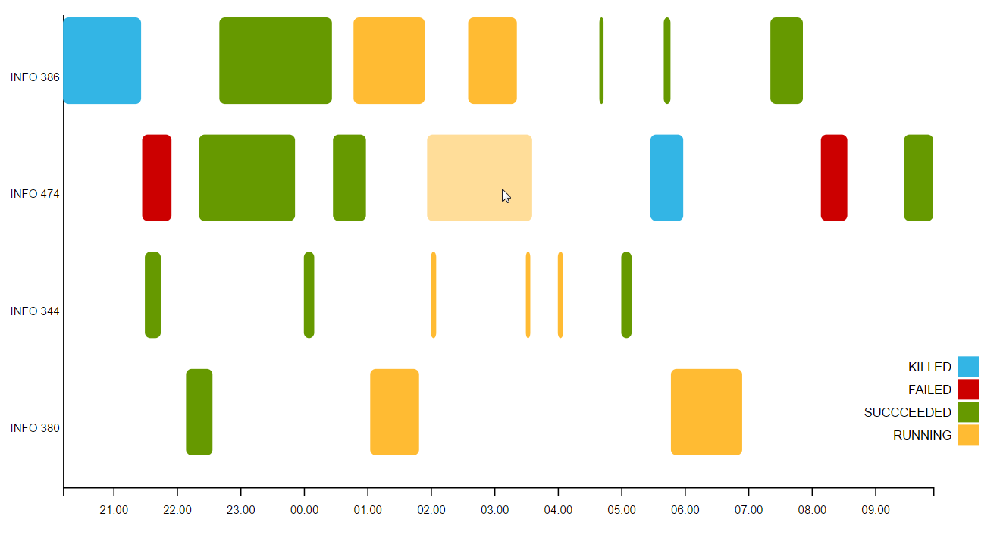

# a3-software-design

This repository contains a visualization tool for **GanttChart()**, based on the D3.js library. The purpose of this tool is to provide reusable, extensible, and configurable software to build a Gantt chart for any given dataset. Gantt chart is a chart that illustrates a project (or multiple tasks) schedule, where a series of boxes show the start and end dates / times of a certain task, categorized and grouped into multiple horizontal lines. The following is a simple example of a Gantt chart built with the provided tool:



## Data Preparation

The Gantt chart tool, as many other D3 tools, presumes that the input data is appropriately structured. If it is not structured correctly, the data will need to be mapped to fit the structure within the main method before calling the tool. For example, in the data used in the example above, the following structured is used:

``` javascript
[
    {
        startDate: new Date("Sun Dec 09 03:46:59 EST 2012"),
        endDate: new Date("Sun Dec 09 04:54:19 EST 2012"),
        taskName: "INFO 474",
        status: "SUCCEEDED"
    },
    {
        startDate: new Date("Sun Dec 09 08:27:35 EST 2012"),
        endDate: new Date("Sun Dec 09 08:58:43 EST 20122"),
        taskName: "INFO 344",
        status: "RUNNING"
    }
]
```

## GanttChart API 

GanttChart can be rendered with multiple parameters, using the following approach:

``` javascript
var ganttChart = GanttChart().statusColors(d3.schemeCategory20b)
                             .displayLegend(true)
                             .barHeight(80)
                             .anotherParameter(value);

var chartWrapper = d3.select('#my-div')
                     .datum([dataSet]) 
                     .call(ganttChart); 
```


### GanttChart Methods

As mentioned above, GanttChart can be rendered with multiple parameters. Note that more methods will be added as developed. The following methods provide parameters that can be exposed with GanttChart:

| Method               | Description |
| -------------------- | ----------- |
| tickFormat("format") | Takes in a `string` of time format to display on the x-axis of the chart. If no argument given, defaults the tickFormat to `"%H:%M"`. An example of a tick format is: `"%d-%H:%M"`. |
| statusColors(["color"]) | Takes in an `array of strings` of colors (can be all formats, i.e. hexadecimal, rgb, words) to display each of the tasks on the chart. If no argument is given, defaults to the color scheme: `["#33b5e5", "#CC0000", "#669900", "#ffbb33"]`. An example of usage is: `statusColors(d3.schemeCategory20b)`. |
| displayLegend(bool) | Takes in a `boolean` to show/hide legend. If no argument is given, defaults to `true`, and displays legend on the rendered chart. |
| hoverEffect(bool) | Takes in a `boolean` to show/hide hover effect. If marked `true`, the task being hovered will become more opaque than other tasks rendered on the chart. If no argument is given, defaults to `true`, and renders the hover effect. |
| width(int) | Takes in an `int` and sets the width of the chart. If no argument is given, defaults the width to 960. |
| height(int) | Takes in an `int` and sets the height of the chart. If no argument is given, defaults the height to 500. |
| barHeight(int) | Takes in an `int` and sets the height of the tasks rendered on the chart. If no argument is given, defaults to the height of the graph divided into the number of task categories times 1.5 (i.e. `barHeight = height / (categories * 1.5)`). |
